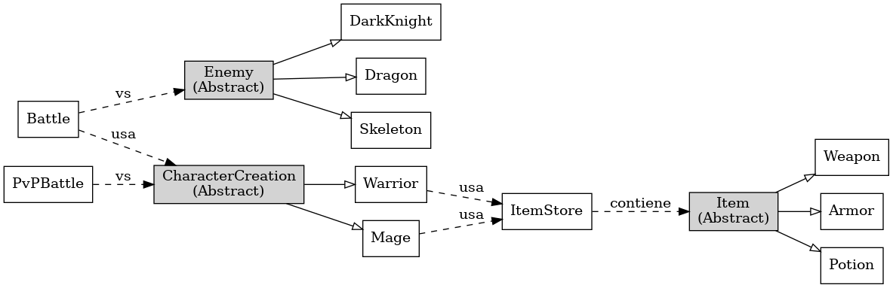

# 🧙‍♂️ NodeRPG - Simulador de Batallas por Turnos


## 📽️ Video Presentación
[Video](https://www.tiktok.com/@davidgomez071/video/7529744069275208966)


**NodeRPG** es un juego de consola interactivo construido con Node.js que simula un mundo de batallas por turnos entre héroes y enemigos. Este proyecto fue desarrollado como parte de un taller para aplicar principios de programación orientada a objetos, arquitectura SOLID, diseño limpio y buenas prácticas de desarrollo.

---

## 🎯 Objetivo del Proyecto

Desarrollar un simulador RPG basado en texto donde:
- El jugador puede crear y personalizar personajes.
- Se simulan batallas contra enemigos o en modo PvP.
- Se pueden usar objetos, habilidades y estrategias por turno.
- Todo el progreso puede ser guardado y cargado dinámicamente.

---

## 🚀 Funcionalidades Clave

### 🔸 Gestión de Personajes

- Crear personajes de distintas clases: `Warrior`, `Mage`.
- Cada clase tiene estadísticas base y habilidades propias.
- Soporte para inventario limitado (máx. 5 ítems).
- Subida de nivel automática con curva de dificultad progresiva.
- Guardado automático de personajes con ID único.

### 🔸 Sistema de Batallas

- Combate por turnos contra enemigos (`Skeleton`, `DarkKnight`, `Dragon`) o contra otros jugadores.
- El jugador puede atacar, usar habilidades o pociones.
- Las habilidades se desbloquean por nivel y tienen efectos únicos.
- Al ganar, se gana oro y experiencia; al perder, la vida se restaura pero no se pierde progreso.

### 🔸 Inventario y Tienda

- Tienda con sistema de compra/venta de:
  - Armas (`+atk`)
  - Armaduras (`+def`)
  - Pociones (`+vida`)
- Cada personaje solo puede portar 5 ítems.
- Restricciones por clase: los guerreros no pueden usar bastones, por ejemplo.

### 🔸 Enemigos por IA

- Enemigos con atributos definidos, comportamiento simple de ataque por turno.

### 🔸 PvP (Jugador vs Jugador)

- Selección de dos personajes guardados para enfrentarlos entre sí.
- Todo se gestiona desde un menú centralizado.
- El combate termina al vencer a un oponente, y los ítems consumidos (pociones) se gastan.

### 🔸 Menú Principal Interactivo

- Menú hecho con `inquirer`.
- Opciones:
  - Crear personaje
  - Cargar personaje
  - Guardar progreso
  - Comenzar aventura
  - Tienda
  - PvP
  - Salir

---

## 🧱 Estructura del Proyecto

```bash
.
├── index.js
├── src/
│   ├── services/
│   │   ├── Battle.js
│   │   ├── PvPBattle.js
│   │   ├── Warrior.js
│   │   ├── Mage.js
│   │   ├── ItemStore.js
│   │   ├── Skeleton.js
│   │   ├── Dragon.js
│   │   └── DarkKnight.js
│   └── abstract/
│       ├── CharacterCreation.js
│       ├── Enemys.js
│       └── Item.js
├── utils/
│   ├── startAdventure.js
│   ├── openStore.js
│   ├── saveCharacter.js
│   ├── loadSavedGame.js
│   ├── createNewCharacter.js
│   └── levelUp.js
├── storage/
│   └── characters.json
└── README.md
```

---

## 🧠 Principios SOLID Aplicados

### ✅ SRP - Principio de Responsabilidad Única
- Cada clase tiene una única responsabilidad:
  - `Battle.js`: lógica de combate PvE.
  - `PvPBattle.js`: lógica PvP.
  - `ItemStore.js`: gestión de compra/venta.
  - `createNewCharacter.js`: manejo de creación.

### ✅ OCP - Principio Abierto/Cerrado
- Puedes agregar nuevas clases (`Archer`, `Paladin`, etc.) heredando de `CharacterCreation` sin modificar las existentes.

### ✅ LSP - Principio de Sustitución de Liskov
- `Mage` y `Warrior` pueden ser tratados como `CharacterCreation` sin romper funcionalidad.

### ✅ ISP - Principio de Segregación de Interfaces
- Aunque en JavaScript no hay interfaces como tal, el diseño divide claramente entre quienes pueden atacar, usar magia, usar ítems.

### ✅ DIP - Principio de Inversión de Dependencias
- `Battle` y `PvPBattle` no dependen directamente de una clase específica, sino que trabajan con personajes instanciados desde abstracciones.

---

## 📈 Diagrama de Clases

> Ver archivo  incluido en el repositorio para una visualización completa de herencia y relaciones.

---

## 💾 Tecnologías Usadas

- Node.js
- Inquirer
- fs-extra
- path
- CommonJS modules

---


---

## 🧑 Equipo de Desarrollo

David Adolfo Gomez Uribe
---


